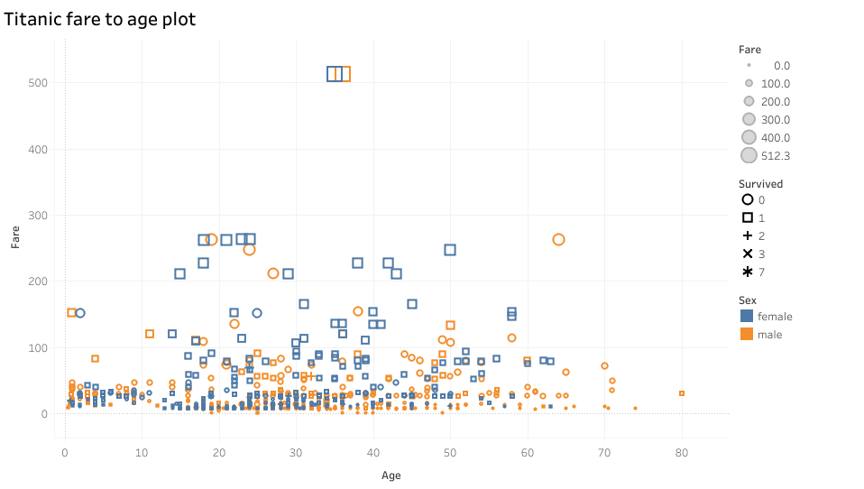
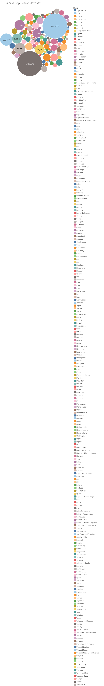
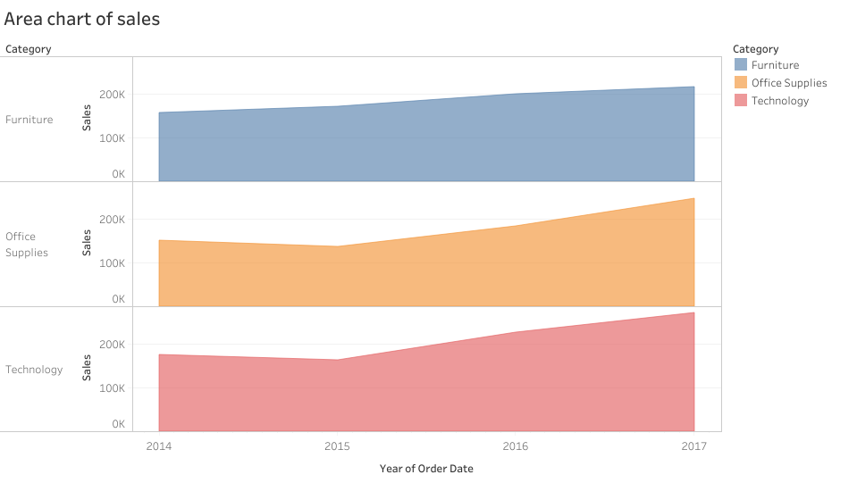
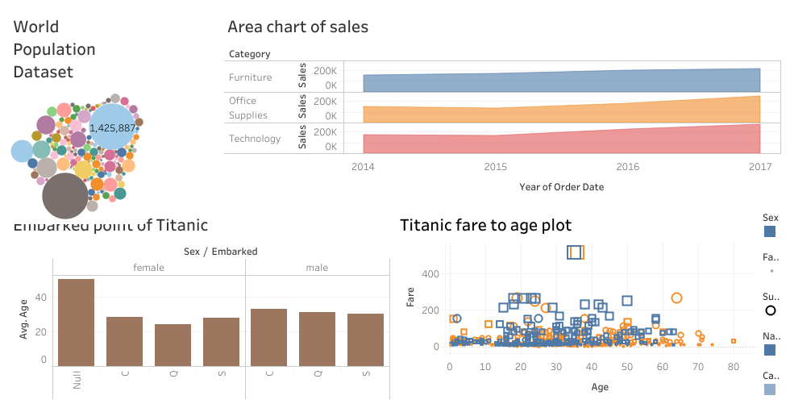

# **Tableau Projects Portfolio**

### **Overview**
Welcome to my Tableau Projects Portfolio! This repository contains a collection of my Tableau visualizations and dashboards, along with descriptions of the insights gained from analyzing various datasets. Explore my work and feel free to visit my Tableau Public profile for interactive versions: [Tableau Public Profile](https://public.tableau.com/app/profile/mohammed.adam8458/vizzes).

---

### **Projects and Visualizations**

#### **1. Titanic Passenger Analysis**
  
- **Visualization Type**: Bar Chart  
- **Description**: Analyzed the average age of Titanic passengers grouped by sex and embarkation point.  
- **Key Features**: Filters for age and sex revealed distinct demographic patterns.

#### **2. Titanic Fare-to-Age Scatter Plot**
  
- **Visualization Type**: Scatter Plot  
- **Description**: Explored the relationship between fares paid and ages of passengers, categorized by gender.  
- **Insights**: Identified significant fare trends while excluding null values.

#### **3. World Population Dataset Visualization**
  
- **Visualization Type**: Bubble Chart  
- **Description**: Visualized population comparisons through bubble sizes to highlight regional growth and density.  

#### **4. Sales Trend Analysis by Category**
  
- **Visualization Type**: Area Chart  
- **Description**: Illustrated trends across categories (Furniture, Office Supplies, Technology) from 2014 to 2017.  
- **Insights**: Demonstrated growth patterns and peak sales performances.

#### **5. Interactive Data Insights Dashboard**
  
- **Visualization Type**: Dashboard  
- **Description**: Combined multiple analyses into a cohesive dashboard featuring population, sales, and Titanic datasets.  
- **Link to Interactive Dashboard**: [View on Tableau Public](https://public.tableau.com/app/profile/mohammed.adam8458/vizzes).

---

### **How to View Interactive Visualizations**
For interactive versions of these visualizations, visit my Tableau Public profile: [public.tableau.com/app/profile/mohammed.adam8458/vizzes](https://public.tableau.com/app/profile/mohammed.adam8458/vizzes).

---

### **About Me**
I am an aspiring data analyst with a passion for discovering insights through data analysis and visualization. Proficient in Python, Tableau, and Microsoft Excel, I continue to develop my technical skills to uncover meaningful patterns and trends.
